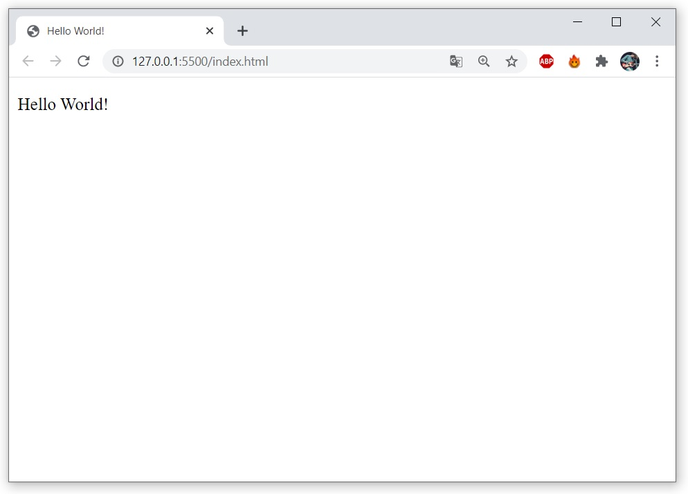

# Hello World!

Hello World ist eine Anwendung zur Ausgabe von Text über Javascript in einem HTML-Dokument.

## Voraussetzung

Für die Anwendung benötigen Sie einen beliebigen Browser.

## Installationsvorgang

Laden sie den master-branch des Repository herunter. Um die Anwendung zu starten, öffnen sie die Datei **index** in einem Browser.